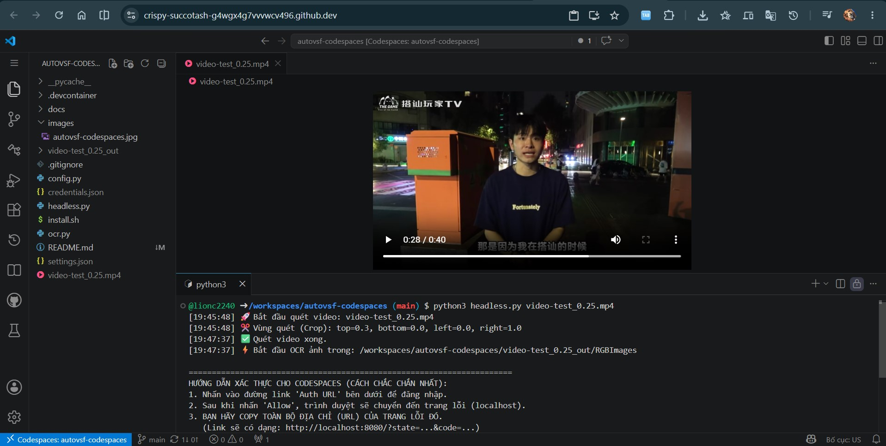
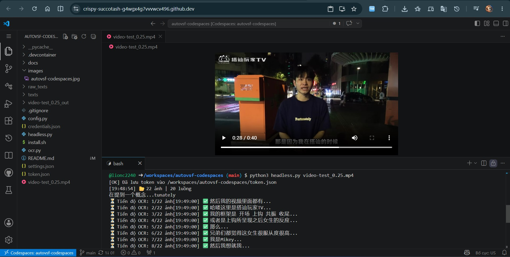

<p align="center">

</p>

# AutoVSF - VideoSubFinder & OCR Pipeline (Codespaces Edition)

> 🌐 **[Tiếng Việt](docs/VIE_README.md)** | **[中文](docs/CN_README.md)**

🔗 **Main Edition (Windows):** [](https://github.com/lionc2240/autovsf)
🔗 **Colab Edition:** [](https://colab.research.google.com/github/lionc2240/autovsf-colab/blob/main/AutoVSF_Colab_Edition.ipynb?hl=vi)


A tool for extracting hardcoded subtitles from videos using VideoSubFinder and text recognition (OCR) via Google Drive API. This edition is optimized specifically for **GitHub Codespaces** and **Linux Headless** environments.

🔗 **Repository:** [https://github.com/lionc2240/autovsf-codespaces.git](https://github.com/lionc2240/autovsf-codespaces.git)

---

## 📖 What does `install.sh` do?

👉 **See detailed explanation at:** [docs/INSTALL_WHAT_AND_HOW.md](docs/INSTALL_WHAT_AND_HOW.md)

Summary: `install.sh` automatically detects the Ubuntu version, installs system libraries (xvfb, ffmpeg, ...), downloads **VideoSubFinder 6.10**, handles library compatibility for Ubuntu 24.04 Noble, installs Python packages (Google Drive API, OpenCV), and creates a `.run` wrapper script to launch VideoSubFinder in a headless environment.

---

## 🐧 GitHub Codespaces Guide

The Codespaces environment is pre-configured automatically. No manual library installation is required.

👉 **See detailed guide at:** [docs/SETUP_CODESPACES.md](docs/SETUP_CODESPACES.md)

### 1. Google Cloud Setup (Required for OCR)
You need a `credentials.json` file to enable the tool to use Google Drive as the OCR engine.

👉 **See detailed guide at:** [docs/GOOGLE_SETUP.md](docs/GOOGLE_SETUP.md)

1. Create a project on [Google Cloud Console](https://console.cloud.google.com/).
2. Enable **Google Drive API**.
3. Under **Credentials**, create an **OAuth client ID** (Application type: Desktop app).
4. Download the JSON file, rename it to `credentials.json`, and place it in the project root.
5. **Important:** Click **PUBLISH APP** in the OAuth Consent Screen section to avoid authentication errors.

### 2. Run everything (Scan Video + OCR)
A single command to scan the video and generate subtitle files:
```bash
python3 headless.py video-test_0.5.mp4
```

### 3. Run OCR only
If you already have images in the output directory (`_out/RGBImages`):
```bash
python3 ocr.py <image_directory_path> [output_filename.srt]
```

### ⚠️ Google Authentication on Codespaces (Important Tip)
Since Google has deprecated the old OOB redirect method, the tool uses **Manual Link Paste** authentication:
1. When running the tool, click the **Auth URL** link displayed in the terminal.
2. Sign in and click **Allow**.
3. Your browser will redirect to an error page (e.g., `http://localhost:8080/?state=...`).
4. **Copy the entire URL** from the browser's address bar.
5. Go back to the Terminal, paste it at the **Paste URL here** prompt, and press Enter.
6. The token will be saved to `token.json` for future use.

---

## 🌟 Key Features
- **Codespaces-optimized:** Runs smoothly in Linux Headless environments.
- **Speed-optimized:** Multi-threaded OCR processing — hundreds of images in seconds.
- **Automated:** End-to-end pipeline from video input to complete `.srt` file output.
- **Smart:** Real-time ETA, automatic token management, and temporary directory cleanup.

---

## 📸 Screenshots

<p align="center">
  
</p>

<p align="center">
  
</p>

---

## ⚠️ General Notes
- Make sure your Google Cloud project is set to **In Production** status.
- The default image output directory from VideoSubFinder is `RGBImages`.
- Always keep your `credentials.json` file secure.
