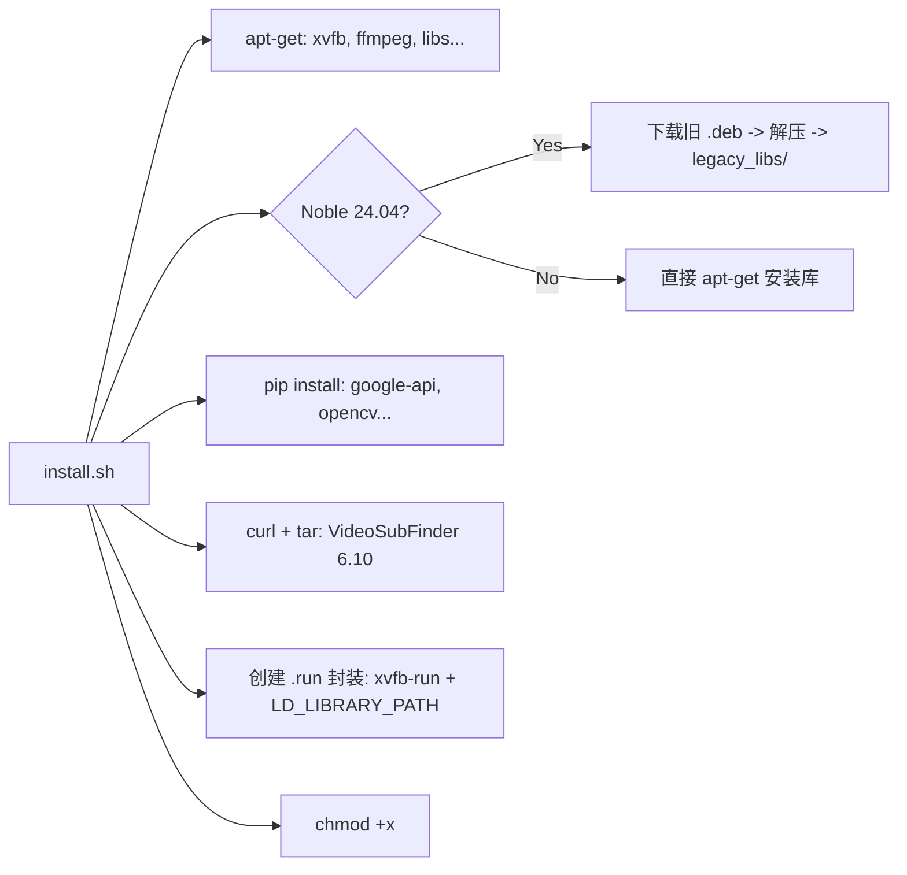

# `install.sh` — 它是做什么的？

`install.sh` 脚本为 `autovsf-codespaces` 在 GitHub Codespaces（Ubuntu 无头环境）上运行设置了完整的运行环境。以下是逐步说明。

---

## 1. 检测 Ubuntu 版本

```bash
OS_CODENAME=$(lsb_release -sc)
```

脚本使用 `lsb_release -sc` 获取 Ubuntu 的代号（例如 `focal` 对应 20.04，`noble` 对应 24.04）。后续所有逻辑都基于此值进行分支。

---

## 2. 安装系统工具

```bash
sudo apt-get install -y xvfb libxss1 libnss3 wget tar curl ffmpeg libxtst6 \
  libxrender1 libxcomposite1 libasound2 libdbus-glib-1-2
```

| 包名 | 作用 |
|---------|------|
| `xvfb` | 创建虚拟帧缓冲（X Virtual Framebuffer），无需物理显示器即可运行 GUI 应用 |
| `libxss1`, `libnss3`, `libxtst6`, `libxrender1`, `libxcomposite1`, `libasound2`, `libdbus-glib-1-2` | VideoSubFinder（wxWidgets 应用）所需的图形/音频库 |
| `wget`, `tar`, `curl` | 下载和解压 VideoSubFinder |
| `ffmpeg` | 视频处理 |

---

## 3. 处理 Yarn GPG 密钥 (Codespaces)

```bash
if [ -f /etc/apt/sources.list.d/yarn.list ]; then
    curl -sS https://dl.yarnpkg.com/debian/pubkey.gpg | sudo gpg --dearmor ...
fi
```

Codespaces 预装了 Yarn，但其 GPG 密钥经常过期，导致 `apt update` 出错。脚本在运行 `apt update` 前检查并更新密钥。

---

## 4. 库兼容性处理 — 两个分支

### 4a. Ubuntu 24.04 Noble (高级 — "隔离补丁"模式)

Ubuntu 24.04 相比 20.04 更改了许多共享库 (.so)，而 VideoSubFinder 需要旧版本。解决方案：**手动下载旧的 .deb 包并提取 .so 文件**。

```bash
declare -A DEBS=(
    ["libaom0"]="https://archive.ubuntu.com/ubuntu/pool/universe/a/aom/libaom0_...deb"
    ["libvpx6"]="https://robohub.eng.uwaterloo.ca/mirror/ubuntu/pool/main/libv/libvpx/..."
    ...
)
```

库被下载、解压（`dpkg -x`），并将 `.so*` 文件复制到 `legacy_libs/` 目录。然后该目录通过 `.run` 封装脚本中的 `LD_LIBRARY_PATH` 添加（见步骤 7）。

**为什么需要这样做？** VideoSubFinder 6.10 是为 Ubuntu 20.04 编译的。它所需的库（libaom0、libvpx6、libx264-155、libx265-179、libflite1、libwavpack1、libwebp6、libcodec2-0.9）在 Ubuntu 24.04 中已被更新版本替换或移除。脚本以可移植的方式捆绑了旧库，而不是重新编译。

### 4b. Ubuntu 20.04 Focal (标准)

```bash
sudo apt-get install -y libgtk-3-0 libasound2 libnuma1 libaom0 libvpx6 \
  libx264-155 libx265-179 libflite1 libwavpack1
```

库在默认仓库中可用，直接安装。

---

## 5. 安装 Python 包

```bash
pip install watchdog google-api-python-client google-auth-oauthlib google-auth httplib2 \
  opencv-python psutil Pillow
```

| 包名 | 作用 |
|---------|------|
| `google-api-python-client`, `google-auth-oauthlib`, `google-auth`, `httplib2` | OCR 的认证和 Google Drive API 调用 |
| `opencv-python` | 图像处理 |
| `Pillow` | 备选图像处理 |
| `watchdog` | 目录变更监控（未来功能） |
| `psutil` | 系统资源监控 |

---

## 6. 下载并解压 VideoSubFinder

```bash
VSF_LINK="https://github.com/.../VideoSubFinder_6.10_ubu20.04.tar.xz"
curl -L -o "$PARENT_DIR/$VSF_FILE" "$VSF_LINK"
tar -xf "$PARENT_DIR/$VSF_FILE" -C "$PARENT_DIR/"
```

- 下载用于 Ubuntu 20.04 的 `VideoSubFinder 6.10`（预打包）。
- 解压到 `../VideoSubFinder/`（repo 目录旁边）。
- 如果目录已存在，脚本会**跳过此步骤**（避免重新下载）。

---

## 7. 创建 `.run` 封装脚本

```bash
cat <<EOF > "$VSF_DIR/VideoSubFinderWXW.run"
#!/bin/sh
export LD_LIBRARY_PATH="$LIBS_DIR:\$PWD:\$LD_LIBRARY_PATH"
if [ -z "\$DISPLAY" ]; then
    xvfb-run -a ./VideoSubFinderWXW "\$@"
else
    ./VideoSubFinderWXW "\$@"
fi
EOF
```

`VideoSubFinderWXW.run` 是最关键的封装：

- **`export LD_LIBRARY_PATH=...`**：在 Ubuntu 24.04 上，优先加载 `legacy_libs/` 中的旧库，避免冲突。
- **`$DISPLAY` 检查**：如果没有显示器可用（无头/Codespaces），自动使用 `xvfb-run -a` 创建虚拟显示器。如果存在真实显示器，则直接运行。
- **`-a`（自动显示）**：自动选择可用的显示编号，避免冲突。

这就是为什么 `headless.py` 调用 `VideoSubFinderWXW.run` 而不是直接调用二进制文件。

---

## 8. 设置可执行权限

```bash
chmod +x run.sh headless.py ocr.py install.sh
chmod +x "$VSF_DIR/VideoSubFinderWXW" "$VSF_DIR/VideoSubFinderWXW.run"
```

确保所有脚本和二进制文件都有可执行（`+x`）权限。

---

## 知识图谱



---

## 整体架构

```
autovsf-codespaces/       # Repo 目录（Python 代码）
  ├── install.sh          # <<< 此脚本
  ├── headless.py         # 协调器（扫描视频 + OCR）
  ├── ocr.py              # Google Drive API OCR 引擎
  ├── config.py           # 共享配置 + 状态
  ├── settings.json       # 用户设置（自动生成）
  ├── docs/               # 文档
  └── ...
../VideoSubFinder/        # 安装目录（由 install.sh 创建）
  ├── VideoSubFinderWXW       # 主二进制文件（GUI 应用）
  ├── VideoSubFinderWXW.run   # 封装脚本（xvfb-run + LD_LIBRARY_PATH）
  └── legacy_libs/            # 旧版 .so 库（用于 Noble 24.04）
```

当您运行 `python3 headless.py video.mp4` 时：
1. `headless.py` 调用 `VideoSubFinderWXW.run` 扫描视频 → 在 `_out/RGBImages/` 中生成图像
2. `headless.py` 调用 `ocr.py` → 上传图像到 Google Drive → Drive OCR → 获取文本 → 组装 `.srt` 文件

`install.sh` 确保整个流水线拥有所有必要的系统库和二进制文件。
