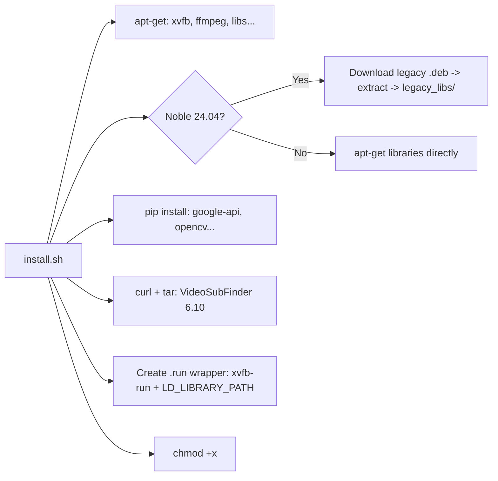

# `install.sh` — What Does It Do?

The `install.sh` script sets up the entire environment for `autovsf-codespaces` to run on GitHub Codespaces (Ubuntu headless). Below is a step-by-step breakdown.

---

## 1. Detect Ubuntu Version

```bash
OS_CODENAME=$(lsb_release -sc)
```

The script uses `lsb_release -sc` to get the Ubuntu codename (e.g., `focal` for 20.04, `noble` for 24.04). All subsequent logic branches based on this value.

---

## 2. Install System Tools

```bash
sudo apt-get install -y xvfb libxss1 libnss3 wget tar curl ffmpeg libxtst6 \
  libxrender1 libxcomposite1 libasound2 libdbus-glib-1-2
```

| Package | Role |
|---------|------|
| `xvfb` | Creates a virtual framebuffer (X Virtual Framebuffer) to run GUI applications without a physical display |
| `libxss1`, `libnss3`, `libxtst6`, `libxrender1`, `libxcomposite1`, `libasound2`, `libdbus-glib-1-2` | Graphics/audio libraries required by VideoSubFinder (a wxWidgets application) |
| `wget`, `tar`, `curl` | Download and extract VideoSubFinder |
| `ffmpeg` | Video processing |

---

## 3. Handle Yarn GPG Key (Codespaces)

```bash
if [ -f /etc/apt/sources.list.d/yarn.list ]; then
    curl -sS https://dl.yarnpkg.com/debian/pubkey.gpg | sudo gpg --dearmor ...
fi
```

Codespaces comes with Yarn pre-installed, but its GPG key often expires, causing errors during `apt update`. The script checks and updates the key before running `apt update`.

---

## 4. Library Compatibility Handling — Two Branches

### 4a. Ubuntu 24.04 Noble (Advanced — "Isolated Patch" Mode)

Ubuntu 24.04 has changed many shared libraries (.so) compared to version 20.04, which VideoSubFinder requires. Solution: **manually download old .deb packages and extract the .so files**.

```bash
declare -A DEBS=(
    ["libaom0"]="https://archive.ubuntu.com/ubuntu/pool/universe/a/aom/libaom0_...deb"
    ["libvpx6"]="https://robohub.eng.uwaterloo.ca/mirror/ubuntu/pool/main/libv/libvpx/..."
    ...
)
```

The libraries are downloaded, extracted (`dpkg -x`), and `.so*` files are copied into the `legacy_libs/` directory. This directory is then added to `LD_LIBRARY_PATH` in the `.run` wrapper script (see step 7).

**Why is this necessary?** VideoSubFinder 6.10 was compiled for Ubuntu 20.04. The libraries it requires (libaom0, libvpx6, libx264-155, libx265-179, libflite1, libwavpack1, libwebp6, libcodec2-0.9) have been replaced with newer versions or removed in Ubuntu 24.04. Instead of recompiling, the script bundles the old libraries in a portable manner.

### 4b. Ubuntu 20.04 Focal (Standard)

```bash
sudo apt-get install -y libgtk-3-0 libasound2 libnuma1 libaom0 libvpx6 \
  libx264-155 libx265-179 libflite1 libwavpack1
```

Libraries are available in the default repo and installed directly.

---

## 5. Install Python Packages

```bash
pip install watchdog google-api-python-client google-auth-oauthlib google-auth httplib2 \
  opencv-python psutil Pillow
```

| Package | Role |
|---------|------|
| `google-api-python-client`, `google-auth-oauthlib`, `google-auth`, `httplib2` | Authentication and Google Drive API calls for OCR |
| `opencv-python` | Image processing |
| `Pillow` | Alternate image processing |
| `watchdog` | Directory change monitoring (future feature) |
| `psutil` | System resource monitoring |

---

## 6. Download & Extract VideoSubFinder

```bash
VSF_LINK="https://github.com/.../VideoSubFinder_6.10_ubu20.04.tar.xz"
curl -L -o "$PARENT_DIR/$VSF_FILE" "$VSF_LINK"
tar -xf "$PARENT_DIR/$VSF_FILE" -C "$PARENT_DIR/"
```

- Downloads `VideoSubFinder 6.10` for Ubuntu 20.04 (pre-packaged).
- Extracts into `../VideoSubFinder/` (next to the repo directory).
- If the directory already exists, the script **skips this step** (avoids re-downloading).

---

## 7. Create the `.run` Wrapper Script

```bash
cat <<EOF > "$VSF_DIR/VideoSubFinderWXW.run"
#!/bin/sh
export LD_LIBRARY_PATH="$LIBS_DIR:\$PWD:\$LD_LIBRARY_PATH"
if [ -z "\$DISPLAY" ]; then
    xvfb-run -a ./VideoSubFinderWXW "\$@"
else
    ./VideoSubFinderWXW "\$@"
fi
EOF
```

`VideoSubFinderWXW.run` is the most critical wrapper:

- **`export LD_LIBRARY_PATH=...`**: On Ubuntu 24.04, old libraries in `legacy_libs/` are loaded first to avoid conflicts.
- **`$DISPLAY` check**: If no display is available (headless/Codespaces), automatically uses `xvfb-run -a` to create a virtual display. If a real display exists, runs directly.
- **`-a`** (auto-display): Automatically selects an available display number, avoiding conflicts.

This is why `headless.py` calls `VideoSubFinderWXW.run` instead of invoking the binary directly.

---

## 8. Set Executable Permissions

```bash
chmod +x run.sh headless.py ocr.py install.sh
chmod +x "$VSF_DIR/VideoSubFinderWXW" "$VSF_DIR/VideoSubFinderWXW.run"
```

Ensures all scripts and binaries have execute (`+x`) permissions.

---

## Knowledge Map



---

## Overall Architecture

```
autovsf-codespaces/       # Repo directory (Python code)
  ├── install.sh          # <<< This script
  ├── headless.py         # Orchestrator (scan video + OCR)
  ├── ocr.py              # OCR engine via Google Drive API
  ├── config.py           # Shared config + state
  ├── settings.json       # User settings (auto-generated)
  ├── docs/               # Documentation
  └── ...
../VideoSubFinder/        # Installation directory (created by install.sh)
  ├── VideoSubFinderWXW       # Main binary (GUI app)
  ├── VideoSubFinderWXW.run   # Wrapper script (xvfb-run + LD_LIBRARY_PATH)
  └── legacy_libs/            # Legacy .so libraries (for Noble 24.04)
```

When you run `python3 headless.py video.mp4`:
1. `headless.py` calls `VideoSubFinderWXW.run` to scan the video → generates images in `_out/RGBImages/`
2. `headless.py` calls `ocr.py` → uploads images to Google Drive → Drive OCR → retrieves text → assembles `.srt` file

`install.sh` ensures the entire pipeline has all the necessary system libraries and binaries.
