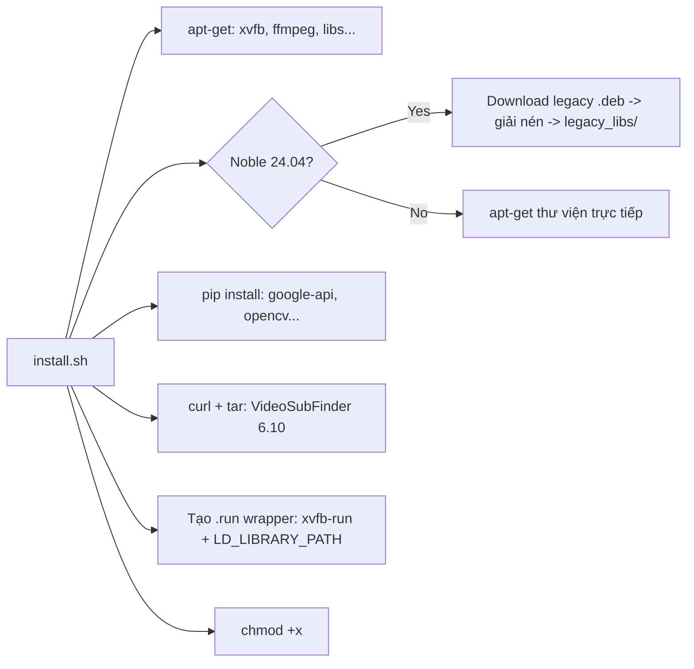

# `install.sh` — Nó đã làm gì?

File `install.sh` là script thiết lập toàn bộ môi trường để `autovsf-codespaces` có thể hoạt động trên GitHub Codespaces (Ubuntu headless).  
Dưới đây là giải thích chi tiết từng bước.

---

## 1. Phát hiện phiên bản Ubuntu

```bash
OS_CODENAME=$(lsb_release -sc)
```

Script dùng `lsb_release -sc` để lấy tên mã Ubuntu (ví dụ: `focal` cho 20.04, `noble` cho 24.04).  
Toàn bộ logic sau đó rẽ nhánh dựa trên giá trị này.

---

## 2. Cài đặt công cụ hệ thống

```bash
sudo apt-get install -y xvfb libxss1 libnss3 wget tar curl ffmpeg libxtst6 \
  libxrender1 libxcomposite1 libasound2 libdbus-glib-1-2
```

| Gói | Vai trò |
|------|---------|
| `xvfb` | Tạo màn hình ảo (X Virtual Framebuffer) để chạy GUI không cần màn hình thật |
| `libxss1`, `libnss3`, `libxtst6`, `libxrender1`, `libxcomposite1`, `libasound2`, `libdbus-glib-1-2` | Thư viện đồ hoạ/âm thanh mà VideoSubFinder (ứng dụng wxWidgets) cần |
| `wget`, `tar`, `curl` | Tải về và giải nén VideoSubFinder |
| `ffmpeg` | Xử lý video |

---

## 3. Xử lý GPG key cho Yarn (Codespaces)

```bash
if [ -f /etc/apt/sources.list.d/yarn.list ]; then
    curl -sS https://dl.yarnpkg.com/debian/pubkey.gpg | sudo gpg --dearmor ...
fi
```

Codespaces mặc định cài sẵn Yarn, nhưng GPG key của nó thường hết hạn, gây lỗi khi `apt update`.  
Script kiểm tra và cập nhật key trước khi `apt update`.

---

## 4. Xử lý tương thích thư viện — Hai nhánh

### 4a. Ubuntu 24.04 Noble (Nâng cao — chế độ "vá lỗi biệt lập")

Ubuntu 24.04 đã thay đổi nhiều thư viện (.so) so với phiên bản 20.04 mà VideoSubFinder yêu cầu.  
Giải pháp: **tải thủ công các gói .deb cũ và giải nén lấy .so**.

```bash
declare -A DEBS=(
    ["libaom0"]="https://archive.ubuntu.com/ubuntu/pool/universe/a/aom/libaom0_...deb"
    ["libvpx6"]="https://robohub.eng.uwaterloo.ca/mirror/ubuntu/pool/main/libv/libvpx/..."
    ...
)
```

Các thư viện được tải về, giải nén (`dpkg -x`) và copy file `.so*` vào thư mục `legacy_libs/`.  
Sau đó, thư mục này được gắn vào `LD_LIBRARY_PATH` trong file `.run` (xem bước 7).

**Tại sao phải làm vậy?**  
VideoSubFinder 6.10 được biên dịch cho Ubuntu 20.04. Các thư viện nó cần (libaom0, libvpx6, libx264-155, libx265-179, libflite1, libwavpack1, libwebp6, libcodec2-0.9) đã bị thay thế bằng phiên bản mới hơn hoặc bị xoá khỏi Ubuntu 24.04. Thay vì biên dịch lại, script "mang" các thư viện cũ theo dưới dạng portable.

### 4b. Ubuntu 20.04 Focal (Chuẩn)

```bash
sudo apt-get install -y libgtk-3-0 libasound2 libnuma1 libaom0 libvpx6 \
  libx264-155 libx265-179 libflite1 libwavpack1
```

Các thư viện có sẵn trong repo, cài trực tiếp.

---

## 5. Cài đặt thư viện Python

```bash
pip install watchdog google-api-python-client google-auth-oauthlib google-auth httplib2 \
  opencv-python psutil Pillow
```

| Gói | Vai trò |
|-----|---------|
| `google-api-python-client`, `google-auth-oauthlib`, `google-auth`, `httplib2` | Xác thực và gọi Google Drive API cho OCR |
| `opencv-python` | Xử lý ảnh |
| `Pillow` | Xử lý ảnh thay thế |
| `watchdog` | Theo dõi thay đổi thư mục (tính năng tương lai) |
| `psutil` | Giám sát tài nguyên hệ thống |

---

## 6. Tải và giải nén VideoSubFinder

```bash
VSF_LINK="https://github.com/.../VideoSubFinder_6.10_ubu20.04.tar.xz"
curl -L -o "$PARENT_DIR/$VSF_FILE" "$VSF_LINK"
tar -xf "$PARENT_DIR/$VSF_FILE" -C "$PARENT_DIR/"
```

- Tải bản `VideoSubFinder 6.10` dành cho Ubuntu 20.04 (đã được đóng gói sẵn).
- Giải nén vào thư mục `../VideoSubFinder/` (bên cạnh thư mục repo).
- Nếu thư mục đã tồn tại, script **bỏ qua bước này** (tránh tải lại).

---

## 7. Tạo wrapper script `.run`

```bash
cat <<EOF > "$VSF_DIR/VideoSubFinderWXW.run"
#!/bin/sh
export LD_LIBRARY_PATH="$LIBS_DIR:\$PWD:\$LD_LIBRARY_PATH"
if [ -z "\$DISPLAY" ]; then
    xvfb-run -a ./VideoSubFinderWXW "\$@"
else
    ./VideoSubFinderWXW "\$@"
fi
EOF
```

File `VideoSubFinderWXW.run` là wrapper quan trọng nhất:

- **`export LD_LIBRARY_PATH=...`**: Khi chạy trên Ubuntu 24.04, các thư viện cũ trong `legacy_libs/` được ưu tiên tải trước, tránh xung đột.
- **Kiểm tra `$DISPLAY`**: Nếu không có màn hình (headless/Codespaces), tự động dùng `xvfb-run -a` để tạo màn hình ảo. Nếu có màn hình thật, chạy trực tiếp.
- **`-a`** (auto-display): Tự động chọn số hiệu display trống, tránh xung đột.

Đây là lý do `headless.py` gọi `VideoSubFinderWXW.run` thay vì gọi binary trực tiếp.

---

## 8. Phân quyền thực thi

```bash
chmod +x run.sh headless.py ocr.py install.sh
chmod +x "$VSF_DIR/VideoSubFinderWXW" "$VSF_DIR/VideoSubFinderWXW.run"
```

Đảm bảo tất cả script và binary đều có quyền `+x`.

---

## Bản đồ kiến thức



---

## Kiến trúc tổng thể

```
autovsf-codespaces/       # Thư mục repo (chứa code Python)
  ├── install.sh          # <<< Script này
  ├── headless.py         # Điều phối toàn bộ (quét video + OCR)
  ├── ocr.py              # OCR engine qua Google Drive API
  ├── config.py           # Cấu hình + trạng thái dùng chung
  ├── settings.json       # Cấu hình người dùng (tự sinh)
  ├── docs/               # Tài liệu hướng dẫn
  └── ...
../VideoSubFinder/        # Thư mục cài đặt (tạo bởi install.sh)
    ├── VideoSubFinderWXW      # Binary chính (GUI app)
    ├── VideoSubFinderWXW.run  # Wrapper script (xvfb-run + LD_LIBRARY_PATH)
    └── legacy_libs/           # Thư viện .so cũ (cho Noble 24.04)
```

Khi bạn chạy `python3 headless.py video.mp4`:
1. `headless.py` gọi `VideoSubFinderWXW.run` để quét video → tạo ảnh trong `_out/RGBImages/`
2. `headless.py` gọi `ocr.py` → upload ảnh lên Google Drive → Drive OCR → lấy text → ghép file `.srt`

`install.sh` đảm bảo toàn bộ chuỗi này có đủ mọi thư viện hệ thống và binary cần thiết.
